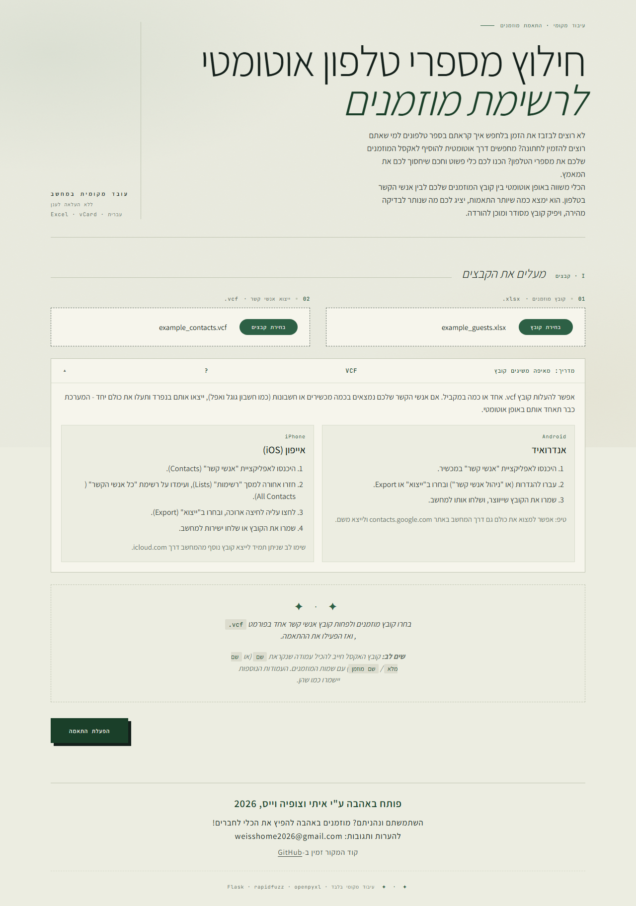
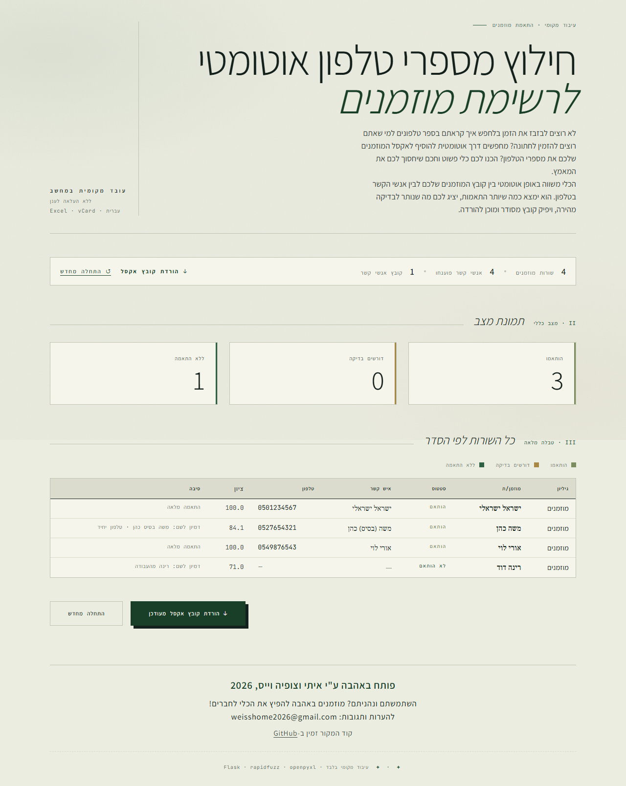
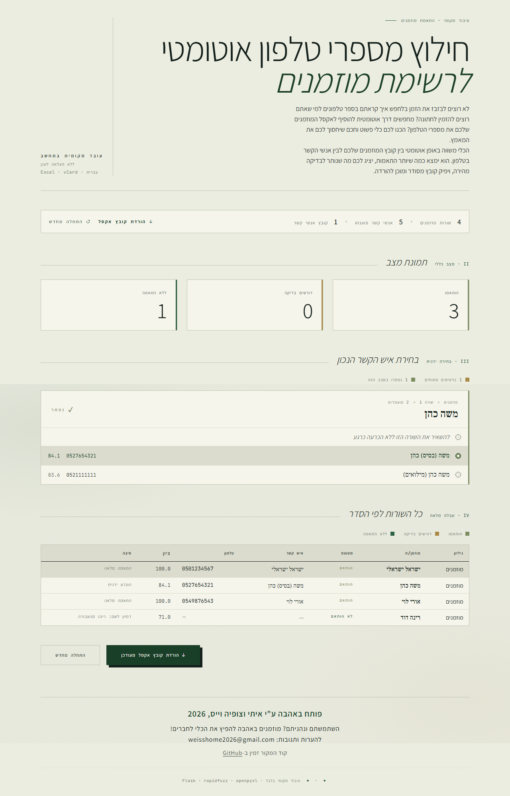

# Guest-List-From-Contacts

Local app for filling guest phone numbers into a wedding guest workbook from a phone contacts export.

## Quick Start (For Regular Users)

You do not need to install Python or write any code to use this tool! Just download the application and run it.

1. Go to the **Releases** page on this GitHub repository (look for the "Releases" section on the right side of the page).
2. Download the latest `GuestListFromContacts.exe` file.
3. Double-click the downloaded `.exe` file to open it.
4. Wait a few seconds — the application will automatically open a new tab in your web browser.
5. Upload your Excel `.xlsx` workbook, and upload the contact `.vcf` exports from your phone.
6. The app will process the list and give you an updated Excel file with phone numbers.

*Note: As this is an indie local application, Windows SmartScreen may show a "Windows protected your PC" popup. If this happens, click **More info** and then **Run anyway**.*

## Product Boundary

- The supported app is the Flask-based localhost desktop flow.
- Running `app.py` or `dist\GuestListFromContacts.exe` starts a local server and opens the app in your default browser.
- This repository is not currently set up for hosted Flask deployment, installers, or code signing.

## Features

- Upload a guest `.xlsx` workbook.
- Upload one or more contacts `.vcf` exports.
- Parse Hebrew vCard names from quoted-printable UTF-8 data.
- Auto-match exact and high-confidence fuzzy matches.
- Show ambiguous rows for manual review in the app.
- Download a new workbook with appended result columns and a summary sheet.

## Screenshots & Example Data

Have a look at the provided synthetic data inside the `example/` directory. You can test the application locally using `example/example_guests.xlsx` and `example/example_contacts.vcf`.

*(The landing screen looks the same as below before selecting files)*

**Upload Interface**


**Review Screen**


**Manual Match Selection**


## Requirements

- Windows 10 or Windows 11 for the packaged `.exe` workflow.
- Python 3.11 or newer only if you want to run from source or build the executable yourself.

## Assumptions

- Every sheet that should be processed contains a column named שם (or שם מלא / שם מוזמן).

## Local Setup

```powershell
python -m venv .venv
.\.venv\Scripts\Activate.ps1
python -m pip install --upgrade pip
python -m pip install -e .[dev]
```

If you prefer not to install the package in editable mode, the app still runs directly from the repository root.

## Run The App

```powershell
.\.venv\Scripts\python app.py
```

Running `app.py` starts the local Flask server on a free localhost port and opens the app in your browser automatically.

If the browser does not open by itself, copy the printed `http://127.0.0.1:PORT/` address from the terminal into your browser.

## Build The .exe

```powershell
.\build_exe.ps1
```

The build script removes old `build\` and `dist\` outputs before creating a fresh package.

The built executable is written to `dist\GuestListFromContacts.exe`. Double-click it, wait for the browser to open, and keep the app window open while you use it.

## Run Tests

```powershell
.\.venv\Scripts\python -m pytest -q
```

## Logging

- The launcher writes runtime logs to `%LOCALAPPDATA%\GuestListFromContacts\logs\app.log`.
- Check that file first if the executable fails to start or an upload fails unexpectedly.

## Troubleshooting

- Browser did not open: Use the localhost URL printed in the terminal window.
- Upload failed immediately: Make sure the workbook is a real `.xlsx` file and the contacts files are `.vcf` exports.
- Upload rejected for size: The app currently limits requests to 50 MB.
- Old packaged files still around: Re-run `build_exe.ps1`; it now rebuilds from a clean `build\` and `dist\` state.

## Notes

- The contacts parser handles folded vCard lines and ignores embedded `PHOTO` payloads.
- Matching is deterministic first. No LLM layer is used in the current MVP.
- Ambiguous matches can be resolved in the review UI before downloading the finished workbook.